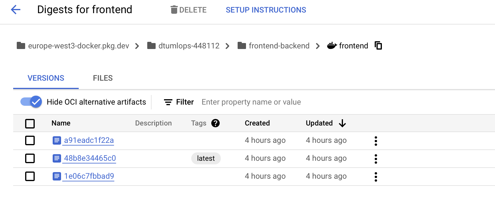

# Exam template for 02476 Machine Learning Operations

This is the report template for the exam. Please only remove the text formatted as with three dashes in front and behind
like:

```--- question 1 fill here ---```

Where you instead should add your answers. Any other changes may have unwanted consequences when your report is
auto-generated at the end of the course. For questions where you are asked to include images, start by adding the image
to the `figures` subfolder (please only use `.png`, `.jpg` or `.jpeg`) and then add the following code in your answer:

```markdown

```

In addition to this markdown file, we also provide the `report.py` script that provides two utility functions:

Running:

```bash
python report.py html
```

Will generate a `.html` page of your report. After the deadline for answering this template, we will auto-scrape
everything in this `reports` folder and then use this utility to generate a `.html` page that will be your serve
as your final hand-in.

Running

```bash
python report.py check
```

Will check your answers in this template against the constraints listed for each question e.g. is your answer too
short, too long, or have you included an image when asked. For both functions to work you mustn't rename anything.
The script has two dependencies that can be installed with

```bash
pip install typer markdown
```

## Overall project checklist

The checklist is *exhaustive* which means that it includes everything that you could do on the project included in the
curriculum in this course. Therefore, we do not expect at all that you have checked all boxes at the end of the project.
The parenthesis at the end indicates what module the bullet point is related to. Please be honest in your answers, we
will check the repositories and the code to verify your answers.

### Week 1

* [x] Create a git repository (M5)
* [x] Make sure that all team members have write access to the GitHub repository (M5)
* [x] Create a dedicated environment for you project to keep track of your packages (M2)
* [x] Create the initial file structure using cookiecutter with an appropriate template (M6)
* [x] Fill out the `data.py` file such that it downloads whatever data you need and preprocesses it (if necessary) (M6)
* [x] Add a model to `model.py` and a training procedure to `train.py` and get that running (M6)
* [x] Remember to fill out the `requirements.txt` and `requirements_dev.txt` file with whatever dependencies that you
    are using (M2+M6)
* [x] Remember to comply with good coding practices (`pep8`) while doing the project (M7)
* [x] Do a bit of code typing and remember to document essential parts of your code (M7)
* [x] Setup version control for your data or part of your data (M8)
* [x] Add command line interfaces and project commands to your code where it makes sense (M9)
* [ ] Construct one or multiple docker files for your code (M10)
* [ ] Build the docker files locally and make sure they work as intended (M10)
* [x] Write one or multiple configurations files for your experiments (M11)
* [x] Used Hydra to load the configurations and manage your hyperparameters (M11)
* [x] Use profiling to optimize your code (M12)
* [ ] Use logging to log important events in your code (M14)
* [x] Use Weights & Biases to log training progress and other important metrics/artifacts in your code (M14)
* [x] Consider running a hyperparameter optimization sweep (M14)
* [x] Use PyTorch-lightning (if applicable) to reduce the amount of boilerplate in your code (M15)

### Week 2

* [x] Write unit tests related to the data part of your code (M16)
* [x] Write unit tests related to model construction and or model training (M16)
* [x] Calculate the code coverage (M16)
* [x] Get some continuous integration running on the GitHub repository (M17)
* [ ] Add caching and multi-os/python/pytorch testing to your continuous integration (M17)
* [ ] Add a linting step to your continuous integration (M17)
* [ ] Add pre-commit hooks to your version control setup (M18)
* [ ] Add a continues workflow that triggers when data changes (M19)
* [ ] Add a continues workflow that triggers when changes to the model registry is made (M19)
* [x] Create a data storage in GCP Bucket for your data and link this with your data version control setup (M21)
* [ ] Create a trigger workflow for automatically building your docker images (M21)
* [x] Get your model training in GCP using either the Engine or Vertex AI (M21)
* [x] Create a FastAPI application that can do inference using your model (M22)
* [x] Deploy your model in GCP using either Functions or Run as the backend (M23)
* [x] Write API tests for your application and setup continues integration for these (M24)
* [x] Load test your application (M24)
* [] Create a more specialized ML-deployment API using either ONNX or BentoML, or both (M25)
* [x] Create a frontend for your API (M26)

### Week 3

* [ ] Check how robust your model is towards data drifting (M27)
* [ ] Deploy to the cloud a drift detection API (M27)
* [ ] Instrument your API with a couple of system metrics (M28)
* [ ] Setup cloud monitoring of your instrumented application (M28)
* [ ] Create one or more alert systems in GCP to alert you if your app is not behaving correctly (M28)
* [ ] If applicable, optimize the performance of your data loading using distributed data loading (M29)
* [ ] If applicable, optimize the performance of your training pipeline by using distributed training (M30)
* [ ] Play around with quantization, compilation and pruning for you trained models to increase inference speed (M31)

### Extra

* [ ] Write some documentation for your application (M32)
* [ ] Publish the documentation to GitHub Pages (M32)
* [ ] Revisit your initial project description. Did the project turn out as you wanted?
* [ ] Create an architectural diagram over your MLOps pipeline
* [x] Make sure all group members have an understanding about all parts of the project
* [x] Uploaded all your code to GitHub

## Group information

### Question 1
> **Enter the group number you signed up on <learn.inside.dtu.dk>**
>
> Answer:

--- 69 ---

### Question 2
> **Enter the study number for each member in the group**
>
> Example:
>
> *sXXXXXX, sXXXXXX, sXXXXXX*
>
> Answer:

--- s194045 Niklas August Kjølbro ---
--- s185034 Andreas Patscheider ---

### Question 3
> **A requirement to the project is that you include a third-party package not covered in the course. What framework**
> **did you choose to work with and did it help you complete the project?**
>
> Recommended answer length: 100-200 words.
>
> Example:
> *We used the third-party framework ... in our project. We used functionality ... and functionality ... from the*
> *package to do ... and ... in our project*.
>
> Answer:

--- For this project, we chose to use the Huggingface library as our third-party package to implement a transformer model. Specifically, we used the pre-trained BERT models provided by Huggingface to classify tweets as either disaster or non-disaster, drawing inspiration from a similar project referenced in models.py. 
Huggingface streamlined the process of working with NLP models by providing ready-to-use, state-of-the-art transformer models and tokenizers. It integrated well with PyTorch LightningModule helping us combine advanced NLP capabilities with PyTorch's boilerplate-free training workflow, simplifying the implementation of our model training and evaluation pipeline.
During preprocessing, we used the Huggingface AutoTokenizer with the pre-trained bert-base-uncased tokenizer to process the tweets. The tweets and location were combined before tokenization. The tokenizer handled essential tasks such as padding and truncation, generating input_ids and attention_mask tensors that were later saved and used as input for the model during training and when making prediction with the model. ---

## Coding environment

> In the following section we are interested in learning more about you local development environment. This includes
> how you managed dependencies, the structure of your code and how you managed code quality.

### Question 4

> **Explain how you managed dependencies in your project? Explain the process a new team member would have to go**
> **through to get an exact copy of your environment.**
>
> Recommended answer length: 100-200 words
>
> Example:
> *We used ... for managing our dependencies. The list of dependencies was auto-generated using ... . To get a*
> *complete copy of our development environment, one would have to run the following commands*
>
> Answer:

--- To manage dependencies in this project, conda was used for environment managements (as suggested in the modules) and requirements.txt to track Python depencencies.

The process for a new team member to replicate the environment:
1) Install conda
Not strictly necessary, but highly suggested for managing isolated environments and dependencies effectively. You could also use other tools like virtualenv or pipenv, but our team has used Conda, so no tutorial on how to use other tools is provided.

2) 
a - There are two ways from here:
Either create environment using the provided environment file (environment.yml):
conda env create -f environment.yml

b - Or create an environment your self (use python 3.11) and simply install from the requirements.txt:
conda create -n ml_env python=3.11
conda activate ml_env
pip install -r requirements.txt

These steps should be all that is needed to reproduce the environment and work on the project. ---

### Question 5

> **We expect that you initialized your project using the cookiecutter template. Explain the overall structure of your**
> **code. What did you fill out? Did you deviate from the template in some way?**
>
> Recommended answer length: 100-200 words
>
> Example:
> *From the cookiecutter template we have filled out the ... , ... and ... folder. We have removed the ... folder*
> *because we did not use any ... in our project. We have added an ... folder that contains ... for running our*
> *experiments.*
>
> Answer:

--- The cookiecutter MLOps template provided in M6 was the starting point and was used throughout the project. We used all the default folders, except for the "notebook" folder, which we removed as we did not use any Jupyter notebooks in our project. In addition to the default structure, we added new folders as the 'frontend-backend' to set up and deploy the Google Cloud API for serving the model and handling predictions. The cookiecutter template significantly simplified the project setup, helping us quickly organize and structure our code from the beginning, which resulted in us not having to waste time reorganizing and structuring our code and project later on. This allowed us instead to focus on the core implementation and follow the course learning objectives. ---

### Question 6

> **Did you implement any rules for code quality and format? What about typing and documentation? Additionally,**
> **explain with your own words why these concepts matters in larger projects.**
>
> Recommended answer length: 100-200 words.
>
> Example:
> *We used ... for linting and ... for formatting. We also used ... for typing and ... for documentation. These*
> *concepts are important in larger projects because ... . For example, typing ...*
>
> Answer:

--- For code quality and formatting, we followed the suggested practices from the modules, maintaining consistent good coding practices throughout the project. This was to ensure that the code was easy to read and understand, both for others and for myself. The PEP 8 styling conventions were followed, utilizing the tool "ruff" to check and format the code automatically in compliance with PEP 8 guidelines.

In terms of documentation, docstrings were used in functions. The aim was to strike a balance in documentation: not too brief to miss important details, but not excessive to overwhelm users. This follows the principle "Code tells you how; comments tell you why."

Typing was used throughout all functions in the project to improve code clarity and reduce potential errors regarding the types of function arguments and return values, especially as the project grows.---

## Version control

> In the following section we are interested in how version control was used in your project during development to
> corporate and increase the quality of your code.

### Question 7

> **How many tests did you implement and what are they testing in your code?**
>
> Recommended answer length: 50-100 words.
>
> Example:
> *In total we have implemented X tests. Primarily we are testing ... and ... as these the most critical parts of our*
> *application but also ... .*
>
> Answer:

--- 
Unit tests were created for the data, model, and later the API. The data test ensures the dataset is correct, with the right number of samples (9096 training, 2274 testing), and validates input data shapes (input_ids and attention_mask of size 61) and target labels (1). The model test checks the forward pass output shape (2) and ensures the output is a tensor. It also verifies that the loss is correctly computed during the training step.The API test checks that the response from the deployed API contains the correct status code, valid JSON, and a prediction value of 0 or 1.
Unit tests
 ---

### Question 8

> **What is the total code coverage (in percentage) of your code? If your code had a code coverage of 100% (or close**
> **to), would you still trust it to be error free? Explain you reasoning.**
>
> Recommended answer length: 100-200 words.
>
> Example:
> *The total code coverage of code is X%, which includes all our source code. We are far from 100% coverage of our **
> *code and even if we were then...*
>
> Answer:

--- Our code coverage was in total 97% meaning that 97% of our code modules (data.py, model.py & api.py) is covered by tests. I would not trust this to be error free. While this is a high percentage, it doesn't guarantee that the code is entirely error-free because code coverage measures how much of the code is executed by tests, but it doesn't assess the quality or thoroughness of those tests.
These are many reasons not to trust code coverage, for reason is that the tests are dedefined by us but there can easily be scenarios or edge cases that was not accounted for in the tests, which can cause issues. Complex functions are also difficult to tests probably or complex interactions.---

### Question 9

> **Did you workflow include using branches and pull requests? If yes, explain how. If not, explain how branches and**
> **pull request can help improve version control.**
>
> Recommended answer length: 100-200 words.
>
> Example:
> *We made use of both branches and PRs in our project. In our group, each member had an branch that they worked on in*
> *addition to the main branch. To merge code we ...*
>
> Answer:

---Yes, we exclusively used GitHub to work on the project and share code. While we didn’t use branches in our workflow, which is generally considered bad practice, we still managed to make it work. However, implementing branches would have significantly improved our process. Branches allow us to work on different features independently without interfering with the main codebase. They make collaboration much easier by reducing conflicts, enabling parallel development, and preventing accidental overwriting of each other's work. The main branch should represent the stable, bug-free version of the code, while branches are used for testing and development. We would merge into the main branch only when we’re confident that our branch is working as expected and free of bugs. Pull requests serve as an essential code review process before merging, allowing team members to provide feedback, identify issues early, and ensure that only code meeting quality standards is approved.---

### Question 10

> **Did you use DVC for managing data in your project? If yes, then how did it improve your project to have version**
> **control of your data. If no, explain a case where it would be beneficial to have version control of your data.**
>
> Recommended answer length: 100-200 words.
>
> Example:
> *We did make use of DVC in the following way: ... . In the end it helped us in ... for controlling ... part of our*
> *pipeline*
>
> Answer:

--- I tried to use DVC for data version control in data.py but faced challenges getting it to work smoothly with Git. Despite configuring Git not to ignore the DVC files, I ran into issues where .gitignore kept ignoring them, causing errors. This made it difficult to track changes automatically in the data, without having to prompt it in the terminal, which is one of the main benefits of DVC. Having version control for data would allow us to easily track and manage different versions of the dataset for reproducibility. It is also useful for tracking how it evolves during training and preprocessing. It would also make collaboration more efficient, as teammates could pull the exact version of the data used for experiments. ---

### Question 11

> **Discuss you continuous integration setup. What kind of continuous integration are you running (unittesting,**
> **linting, etc.)? Do you test multiple operating systems, Python  version etc. Do you make use of caching? Feel free**
> **to insert a link to one of your GitHub actions workflow.**
>
> Recommended answer length: 200-300 words.
>
> Example:
> *We have organized our continuous integration into 3 separate files: one for doing ..., one for running ... testing*
> *and one for running ... . In particular for our ..., we used ... .An example of a triggered workflow can be seen*
> *here: <weblink>*
>
> Answer:

--- question 11 fill here ---

## Running code and tracking experiments

> In the following section we are interested in learning more about the experimental setup for running your code and
> especially the reproducibility of your experiments.

### Question 12

> **How did you configure experiments? Did you make use of config files? Explain with coding examples of how you would**
> **run a experiment.**
>
> Recommended answer length: 50-100 words.
>
> Example:
> *We used a simple argparser, that worked in the following way: Python  my_script.py --lr 1e-3 --batch_size 25*
>
> Answer: --- I configured the experiment using a config.yaml file to specify key hyperparameters like learning rate, batch size, and epochs, ensuring reproducibility. However, training was computationally intensive, taking a long time and using significant memory. To optimize this, I implemented a sweep configuration with W&B, defining hyperparameter ranges for automated experimentation (e.g., learning rate, batch size, and epochs). The sweep was designed to find the best parameters through multiple runs but wasn't executed due to the excessive time it would require.

To run the configs.yaml simply run:
python src/mlops_project/model.py --config-path configs/config.yaml

To pass specific parameters to training run (if you include --config-path configs/config.yaml then it chooses those hyper parameters):
python src/mlops_project/model.py --lr 0.002 --batch-size 16 --epochs 2

For sweep:
wandb sweep configs/sweep.yaml   
Then pass the sweep agent:
wandb agent <sweep_id>

---

### Question 13

> **Reproducibility of experiments are important. Related to the last question, how did you secure that no information**
> **is lost when running experiments and that your experiments are reproducible?**
>
> Recommended answer length: 100-200 words.
>
> Example:
> *We made use of config files. Whenever an experiment is run the following happens: ... . To reproduce an experiment*
> *one would have to do ...*
>
> Answer:

--- To ensure the reproducibility of our experiments and prevent the loss of information, we implemented version control for our data using DVC. Although we mostly interacted with DVC through the terminal, it allowed us to track changes to the dataset and model files, making it easy to revert to previous versions if necessary. Additionally, we used configuration files to store the specifications for our experiments, including model parameters and training settings, which made it easier to rerun experiments with the same setup. Finally, we stored a database of predicted values after each model run, ensuring that we kept track of all outputs generated by the model, allowing us to reference and compare results across different experiment iterations. ---

### Question 14

> **Upload 1 to 3 screenshots that show the experiments that you have done in W&B (or another experiment tracking**
> **service of your choice). This may include loss graphs, logged images, hyperparameter sweeps etc. You can take**
> **inspiration from [this figure](figures/wandb.png). Explain what metrics you are tracking and why they are**
> **important.**
>
> Recommended answer length: 200-300 words + 1 to 3 screenshots.
>
> Example:
> *As seen in the first image when have tracked ... and ... which both inform us about ... in our experiments.*
> *As seen in the second image we are also tracking ... and ...*
>
> Answer:

--- 

The provided screenshot from W&B shows the metrics tracked during training: train_acc, train_loss, val_acc, val_loss, and epoch.
* Train Accuracy (train_acc): Measures how well the model performs on the training data. It helps monitor overfitting or underfitting trends.
* Train Loss (train_loss): Tracks the error the model makes on the training set. A decreasing loss indicates learning progress.
* Validation Accuracy (val_acc): Measures performance on unseen data. In this case, it is increasing, indicating the model is improving generalization despite fluctuations in validation loss.
* Validation Loss (val_loss): Tracks error on the validation set. Here, it is increasing, which may signal overfitting or an issue with the training process.
Epoch: the number of training iterations, giving context to the trends.
The early stopping mechanism stopped training at epoch 3 (out of a maximum of 5), which prevented unnecessary computation as val_acc continued increasing while val_loss began to increase. This suggests the model is still learning useful patterns but may also be starting to overfit.

Additional confusion matrix was made to evaluate the classification performance on disaster tweets:


The confusion matrix reveals an imbalance in the model's performance. While it performs well on Class 0 (real-disaster tweets), with low misclassification (24 errors), it struggles with Class 1 (non-disaster tweets), misclassifying a significant portion (230 errors).
Suggests:
1) Class imbalance in the dataset, which biases the model toward the majority class (non-disaster tweets).
2) The need for additional techniques to improve performance. However, improving the model was not prioritized in this course, as the main focus was not on maximizing model accuracy but on understanding the workflow, experimentation, and operational processes of machine learning development.
 ---

### Question 15

> **Docker is an important tool for creating containerized applications. Explain how you used docker in your**
> **experiments/project? Include how you would run your docker images and include a link to one of your docker files.**
>
> Recommended answer length: 100-200 words.
>
> Example:
> *For our project we developed several images: one for training, inference and deployment. For example to run the*
> *training docker image: `docker run trainer:latest lr=1e-3 batch_size=64`. Link to docker file: <weblink>*
>
> Answer:

--- 
In our MLOps project, Docker played a critical role in ensuring the seamless deployment of both the backend API and the frontend application. Here’s how Docker was utilized: <br>

#### Backend API:
1. **Containerizing the Backend API**  
   The backend API was developed to interact with a machine learning model deployed on Google Cloud. Docker was used to package this API along with its dependencies into a container, ensuring a consistent runtime environment across all platforms.  
2. **Pushing the Backend Docker Image**  
   After containerization, the backend Docker image was pushed to Google Cloud Artifact Registry. This allowed it to be hosted and integrated seamlessly into the overall deployment pipeline.  

#### Frontend Application:
1. **Containerizing the Frontend**  
   The frontend application, designed to connect to the deployed backend API, was also packaged into a Docker container. This guaranteed that all dependencies, libraries, and configurations were included for consistent execution.  
2. **Pushing the Frontend Docker Image**  
   Similar to the backend, the frontend Docker image was pushed to Google Cloud Artifact Registry. This made it easily accessible for hosting and deployment.  

Thus the hosting of both our backend API and frontend application was made possible through Docker containerization. This ensured that the applications could be deployed and run consistently across different environments. <br>

To build the Docker images, the following commands were used:
- **Backend API**: `docker build --platform linux/amd64 -t backend:latest -f backend.dockerfile .`
- **Frontend Application**: `docker build --platform linux/amd64 -t frontend:latest -f frontend.dockerfile .`

To run the Docker images, the following commands were used:
- **Backend API**: `docker run --platform linux/amd64 --rm -p 8080:8080 -e PORT=8080 backend:latest`
- **Frontend Application**: `docker run --platform linux/amd64 --rm -p 8001:8001 -e "PORT=8001" frontend `

Finally to tag and push the Docker images to Google Cloud Artifact Registry, the following commands were used:
- **Tagging the Docker Image**: `docker tag frontend:latest \europe-west3-docker.pkg.dev/dtumlops-448112/frontend-backend/frontend:latest` & `docker tag backend:latest \europe-west3-docker.pkg.dev/dtumlops-448112/frontend-backend/backend:latest`
- **Pushing the Docker Image**: `docker push europe-west3-docker.pkg.dev/dtumlops-448112/frontend-backend/frontend:latest` & `docker push europe-west3-docker.pkg.dev/dtumlops-448112/frontend-backend/backend:latest`
- **Google cloud run deployment**: `gcloud run deploy frontend \ --image=europe-west3-docker.pkg.dev/dtumlops-448112/frontend-backend/frontend:latest \ --region=europe-west3 \ --platform=managed \` & `gcloud run deploy backend \ --image=europe-west3-docker.pkg.dev/dtumlops-448112/frontend-backend/backend:latest \ --region=europe-west3 \ --platform=managed` <br>

Link to Dockerfiles:

[Backend Dockerfile](/../frontend-backend/backend.dockerfile) 

[Frontend Dockerfile](/../frontend-backend/frontend.dockerfile)

---

### Question 16

> **When running into bugs while trying to run your experiments, how did you perform debugging? Additionally, did you**
> **try to profile your code or do you think it is already perfect?**
>
> Recommended answer length: 100-200 words.
>
> Example:
> *Debugging method was dependent on group member. Some just used ... and others used ... . We did a single profiling*
> *run of our main code at some point that showed ...*
>
> Answer:

--- 
Debugging was an essential part of our project workflow, and we employed different techniques depending on the stage of development:

1. **Debugging During Development**  
   While writing and refining our code, we extensively used breakpoints in our development environment to verify the execution flow and inspect variable states. This step-by-step approach helped us isolate issues at specific points in the code and ensured each component behaved as expected.

2. **Debugging During Containerization and Deployment**  
   When containerizing the application and deploying it to Google Cloud, most debugging relied on analyzing logs. By observing the logging outputs, we could trace issues back to their origin and identify misconfigurations or runtime errors within the containerized environments.

3. **Profiling the Code**  
   While we did not perform extensive profiling, we ensured the main components of the system were efficient by monitoring performance metrics during testing. Logging and observing runtime behaviors served as a lightweight profiling approach to verify functionality. <br>
These methods combined helped us address bugs and maintain a robust application pipeline.

---

## Working in the cloud

> In the following section we would like to know more about your experience when developing in the cloud.

### Question 17

> **List all the GCP services that you made use of in your project and shortly explain what each service does?**
>
> Recommended answer length: 50-200 words.
>
> Example:
> *We used the following two services: Engine and Bucket. Engine is used for... and Bucket is used for...*
>
> Answer:

--- IAM & admin was used to manage access and permissions for the various services. Controlling who has access to our resources across the project. Service accounts were created for authentication and authorization.
Secure Manager was used to store sensitive credentials, such as the Kaggle JSON file for automatically downloading datasets from Kaggle and the WANDB API key for tracking experiments and managing hyperparameter tuning.
Cloud Storage two Cloud Storage buckets were created: one to store the raw tweets data and another to store the trained model. This setup ensures that new users with credentials to the Google Cloud project can easily run the project. If they choose to retrain the model, the data will be automatically fetched from the storage. Alternatively, they can use the stored trained model to make predictions via the API.
Cloud Run was used to deploy the disaster tweet prediction API for our trained model. This serverless service enabled us to host the API efficiently, with automatic scaling to handle incoming requests. ---

### Question 18

> **The backbone of GCP is the Compute engine. Explained how you made use of this service and what type of VMs**
> **you used?**
>
> Recommended answer length: 100-200 words.
>
> Example:
> *We used the compute engine to run our ... . We used instances with the following hardware: ... and we started the*
> *using a custom container: ...*
>
> Answer:

--- We used the Compute Engine's virtual machine (VM) service to set up an instance for model training. The instance was named ml69, with a machine type of n1-standard-1, which offers a balanced setup for general-purpose workloads. The VM was located in the europe-west1-b zone to be closer to us.  Since the instance did not include GPUs, the training process was slower than expected.  accessed the instance remotely through the terminal to manage the environment and execute tasks.
To create a similar VM using the gcloud command, you can run the following:
gcloud compute instances create vm-name \
  --zone=europe-west1-b \
  --machine-type=n1-standard-1
Once the VM was set up, we cloned our GitHub repository into the virtual machine to initiate model training. ---

### Question 19

> **Insert 1-2 images of your GCP bucket, such that we can see what data you have stored in it.**
> **You can take inspiration from [this figure](figures/bucket.png).**
>
> Answer:

--- 
We used the bucket service for two purposes. One for storing our data, which can be seen enclosed below 
And the other for storing our model artifacts, which is enclosed in the following: . 
The bucket service allowed us to store and access data and model artifacts in a scalable and secure manner.

---

### Question 20

> **Upload 1-2 images of your GCP artifact registry, such that we can see the different docker images that you have**
> **stored. You can take inspiration from [this figure](figures/registry.png).**
>
> Answer:

--- 
In the following picture you can see the different docker images that we have stored in our GCP artifact registry. 

---

### Question 21

> **Upload 1-2 images of your GCP cloud build history, so we can see the history of the images that have been build in**
> **your project. You can take inspiration from [this figure](figures/build.png).**
>
> Answer:

--- 
In the following picture the build history of the images that have been built in our project can be seen. The first enclosed picture shows the build history of our backend image, and the second picture shows the build history of our frontend image.  

---

### Question 22

> **Did you manage to train your model in the cloud using either the Engine or Vertex AI? If yes, explain how you did**
> **it. If not, describe why.**
>
> Recommended answer length: 100-200 words.
>
> Example:
> *We managed to train our model in the cloud using the Engine. We did this by ... . The reason we choose the Engine*
> *was because ...*
>
> Answer:

--- We managed to train our model on the virtual machine using Compute Engine. A virtual machine instance was created on Compute Engine, and we accessed it through our terminal in VSCode with the following command:

gcloud compute instances start ml69 --zone=europe-west1-b 

Afterwards, we cloned our GitHub project into the virtual environment. With the buckets already set up, it was easy to retrieve the data and start training the model. Once the training was completed, the model was saved in our Cloud Storage for future use.

Although we successfully trained the model, it was only used as a proof of concept. This was due to the Compute Engine being significantly slower for training compared to training locally, which made it less practical.

Additionally, Vertex AI was also utilized. A config_cpu.yaml file is located in the configs folder. To run it, simply use the following command:

gcloud ml69 custom-jobs create \
    --region=europe-west1 \
    --display-name=test-run \
    --config=configs/config_gpu.yaml \
    --command 'python src/mlops_project/model.py' \
    --args '["--epochs", "3"]'      ---

## Deployment

### Question 23

> **Did you manage to write an API for your model? If yes, explain how you did it and if you did anything special. If**
> **not, explain how you would do it.**
>
> Recommended answer length: 100-200 words.
>
> Example:
> *We did manage to write an API for our model. We used FastAPI to do this. We did this by ... . We also added ...*
> *to the API to make it more ...*
>
> Answer:

--- 
### API Implementation for the Model

Yes, we successfully wrote an API for our model using **FastAPI** to enable easy interaction and deployment of the machine learning model.

#### **Backend API Design**
- The API includes endpoints for predicting the classification of disaster tweets and serves as an interface between the frontend and the deployed model.
- On startup, the model is loaded from **Google Cloud Storage** (GCS). The model, a fine-tuned BERT-based architecture, is retrieved as a `.pth` file from a specified GCS bucket. This ensures the latest model version is always available.

#### **Special Features**
1. **Text Preprocessing**:  
   Text inputs are cleaned to remove unwanted elements such as URLs, hashtags, and special characters using a `clean_text` function.
   
2. **Inference Pipeline**:  
   The API processes input data by tokenizing it with the `bert-base-uncased` tokenizer. It then performs inference using the loaded PyTorch model and outputs a prediction.

3. **Dynamic Inputs**:  
   The `/predict/` endpoint allows users to provide text inputs and, optionally, location data. These are seamlessly combined and processed for classification.

4. **Logging and Deployment**:  
   The API was designed with robust logging and deployed as a containerized service on **Google Cloud Artifact Registry**, ensuring high scalability and accessibility.

This modular approach makes the API efficient, reusable, and easy to maintain.

---

### Question 24

> **Did you manage to deploy your API, either in locally or cloud? If not, describe why. If yes, describe how and**
> **preferably how you invoke your deployed service?**
>
> Recommended answer length: 100-200 words.
>
> Example:
> *For deployment we wrapped our model into application using ... . We first tried locally serving the model, which*
> *worked. Afterwards we deployed it in the cloud, using ... . To invoke the service an user would call*
> *`curl -X POST -F "file=@file.json"<weburl>`*
>
> Answer:

---
#### Deployment of the API

Yes, we successfully deployed our API both locally and in the cloud.

#### **Local Deployment**
- Initially, the API was deployed locally using the command:
  ```bash
  uvicorn backend:app --reload
    ```
- To test the API locally and interact with it, we sent POST requests to the local server using or **curl**:
    ```bash
    curl -X POST "http://127.0.0.1:8000/predict//" \ -H "Content-Type: application/json" \ -d '{"input_data": ["The recent fires in California have been devastating"],"location": "California"}'
    ```
- The API was tested using various input data to ensure correct functionality and response.

#### **Cloud Deployment**
- After successful local testing, the API was containerized using Docker to ensure portability and consistent runtime environments
- The containerized API image was pushed to Google Cloud Artifact Registry and deployed on Google Cloud.
- To invoke the cloud-deployed API, users replace the local URL (127.0.0.1) with the public endpoint provided by Google Cloud:
    ```bash
    curl -X POST "https://backend-912555186187.europe-west3.run.app/predict/" \ -H "Content-Type: application/json" \ -d '{"input_data": ["The recent fires in California have been devastating"],"location": "California"}'
    ```
- The cloud-deployed API was tested using the same input data to ensure consistent behavior and response.

---

### Question 25

> **Did you perform any unit testing and load testing of your API? If yes, explain how you did it and what results for**
> **the load testing did you get. If not, explain how you would do it.**
>
> Recommended answer length: 100-200 words.
>
> Example:
> *For unit testing we used ... and for load testing we used ... . The results of the load testing showed that ...*
> *before the service crashed.*
>
> Answer:

--- question 25 fill here ---

### Question 26

> **Did you manage to implement monitoring of your deployed model? If yes, explain how it works. If not, explain how**
> **monitoring would help the longevity of your application.**
>
> Recommended answer length: 100-200 words.
>
> Example:
> *We did not manage to implement monitoring. We would like to have monitoring implemented such that over time we could*
> *measure ... and ... that would inform us about this ... behaviour of our application.*
>
> Answer:

--- question 26 fill here ---

## Overall discussion of project

> In the following section we would like you to think about the general structure of your project.

### Question 27

> **How many credits did you end up using during the project and what service was most expensive? In general what do**
> **you think about working in the cloud?**
>
> Recommended answer length: 100-200 words.
>
> Example:
> *Group member 1 used ..., Group member 2 used ..., in total ... credits was spend during development. The service*
> *costing the most was ... due to ... . Working in the cloud was ...*
>
> Answer:

--- question 27 fill here ---

### Question 28

> **Did you implement anything extra in your project that is not covered by other questions? Maybe you implemented**
> **a frontend for your API, use extra version control features, a drift detection service, a kubernetes cluster etc.**
> **If yes, explain what you did and why.**
>
> Recommended answer length: 0-200 words.
>
> Example:
> *We implemented a frontend for our API. We did this because we wanted to show the user ... . The frontend was*
> *implemented using ...*
>
> Answer:

--- question 28 fill here ---

### Question 29

> **Include a figure that describes the overall architecture of your system and what services that you make use of.**
> **You can take inspiration from [this figure](figures/overview.png). Additionally, in your own words, explain the**
> **overall steps in figure.**
>
> Recommended answer length: 200-400 words
>
> Example:
>
> *The starting point of the diagram is our local setup, where we integrated ... and ... and ... into our code.*
> *Whenever we commit code and push to GitHub, it auto triggers ... and ... . From there the diagram shows ...*
>
> Answer:

--- question 29 fill here ---

### Question 30

> **Discuss the overall struggles of the project. Where did you spend most time and what did you do to overcome these**
> **challenges?**
>
> Recommended answer length: 200-400 words.
>
> Example:
> *The biggest challenges in the project was using ... tool to do ... . The reason for this was ...*
>
> Answer:

--- question 30 fill here ---

### Question 31

> **State the individual contributions of each team member. This is required information from DTU, because we need to**
> **make sure all members contributed actively to the project**
>
> Recommended answer length: 50-200 words.
>
> Example:
> *Student sXXXXXX was in charge of developing of setting up the initial cookie cutter project and developing of the*
> *docker containers for training our applications.*
> *Student sXXXXXX was in charge of training our models in the cloud and deploying them afterwards.*
> *All members contributed to code by...*
>
> Answer:

--- question 31 fill here ---
